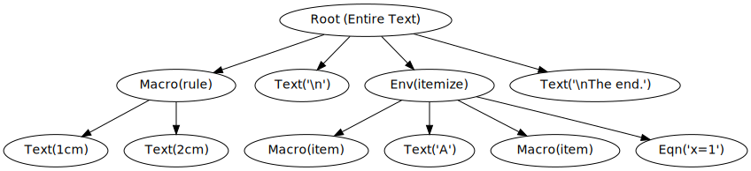
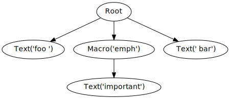
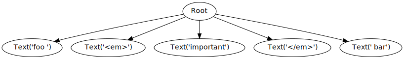
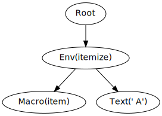
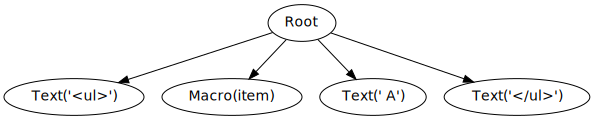

.. _plugins:

Plugins
*******

Plugins control the conversion of LaTeX- macros and environments to HTML.

Nobby converts a LaTeX document into a tree. The root node
contains the entire document body. Its children contain
non-overlapping partitions thereof. Children may have themselves have
children if the environments are nested (eg. an *itemize* inside an
*itemize*, or an equation inside an *enumerate*, etc).

For instance, the document

.. code-block:: latex

    \rule{1cm}{2cm}
    \begin{itemize}
      \item A
      \item $x=1$
    \end{itemize}
    The end.

has the following tree representation in Nobby:

Note how the `\rule` macro has two children, whereas the `\item` macros
have none. Nobby does not know how many arguments a macro requires
and always assumes that every [] or {} environment immediately after
the macro are its arguments. It is certainly possibly to mislead Nobby
in this regard, but in that case you only have yourself to blame if it
does not work.

Nobby distinguishes only a few node types, and of these only three
matter to plugins: *text*, *macro*, and *env*. Unsurprisingly, *text*
is for normal text, *macro* denotes a macro (its children are the
arguments), and *env* node represent anything with an explicit `\begin`
and `\end` delimiter.

Text nodes make it verbatim into the HTML output, whereas *macro* and
*env* nodes will become SVG images. Unless a plugin exists for them.

Plugins are Python functions which receive a list of *nodes*. In the
example above the `\rule` plugin would receive two nodes, whereas the
`\itemize` plugin would receive four.

Every plugin must return a list of nodes. For convenience, the list
may also contain strings instead of text nodes which Nobby 
automatically converts to *text* nodes. Nobby will then replace the
original *macro* or *env* node with the list of nodes returned by the
plugin.

This is simpler than it may sounds, and the example below will
hopefully demonstrate it.

.. note::
   To activate a plugin, add it to the ``plugins`` dictionary at the
   end of 'plugins.py'.

Example: ldots
==============

Here is the plugin for the `\ldots` macro.

.. code-block:: python

    def ldots(nodes):
        return '...', nodes

Like every plugin, it receives a list of nodes (probably empty since
`\ldots` requires no arguments). It only needs to return '...' because
this is the HTML equivalent of the `\ldots` macro in LaTeX.
Nevertheless, it is safe and proper to return any unconsumed nodes.

Example: emph
==============

Here is the plugin for the `\emph` macro.

.. code-block:: python

    def emph(nodes):
        return '<em>', nodes, '</em>'

This macro takes one argument. The argument usually consists only of
plain text, but may contain other macros and equations as
well. As such, the ``nodes`` argument may be a list of one or more
nodes. Fortunately, we need not concern ourselves with the content of
those *nodes*. All we need to do is to return the original **nodes**
list enclosed in <em> tags. Nobby will then proceed to expand the
nodes we returned. Whatever they expand to (plain text, an image, or
more nodes returned by another plugin), it will be inside the <em>
tags.

Example: the LaTeX code 'foo \emph{important} bar' corresponds to
the tree

Without our plugin for `\emph`, Nobby would create the LaTeX file
`\begin{document}\emph{important}\end{document}` and compile
it into an SVG image.

In contrast, with our plugin for `\emph` the following will happen:
Our plugins receives the list of **nodes=[text('important')]** and
returns **[<em>, [text('important')], </em>]**. Nobby will then
convert the strings and flatten the list to obtain the new list
**[text('<em>'), text('important'), text('</em>')]**. Afterwards it
replaces the original macro('emph') node with the (flattened) content
of this list, which leads to the following (now flat) tree:

In other words, only text nodes remain and they always make it
verbatim into the HTML file. No SVG images are created.

Example: itemize
================

Here is an example for an environment plugin. Nobby does not
distinguish between *macro*- and *env* nodes as far as plugins are
concerned. They have the same call signature, and must return the same
data types.

The HTML equivalent for `itemize` is an unorderd list. The HTML tags
are `<ul>` and `</ul>` and they replace `\begin{itemize}` and
`\end{itemize}`, respectively. The following code does exactly that:

.. code-block:: python

    def itemize(nodes):
        return '<ul>', nodes, '</ul>'

Before we get to the `\item` macros almost certainly present somewhere
inside the `itemize` environment, here is what happens in the tree.
Suppose the LaTeX code is 

.. code-block:: latex

 \begin{itemize}
  \item A
 \end{itemize}

The plugin receives **nodes = [macro(item), text(' A')]** and returns
list **['<ul>', macro(item), text( A), '</ul>']**. Nobby will again
replace the strings with proper text nodes to obtain **[text('<ul>'),
macro(item), text(' A'), text('</ul>')]** and substitutes the *env* node
with this list (dropping all children of the original *env*
node):

This tree contains only text node (verbatim HTML code) and an `\item`
macro. Since it is just a macro we can write a plugin for it:

.. code-block:: python

    def item(nodes):
        return '<li>', nodes

This works just like the `\ldots` macro. Easy.

.. note::
   Without a plugin for `\item` Nobby would create a document with
   only an `\item` command in it, which `pdflatex` would probably not
   compile.

    
Example: maketitle
==================

The last example concerns the removal of LaTeX environments and
macros. This is sometimes necessary to neutralise LaTeX commands that
make no sense in HTML, eg. `\newpage` or `\parskip`. In this example we
will neutralise the `\maketitle` macro.

.. code-block:: python

    def maketitle(nodes):
        return '', nodes
    
This macro returns an empty string and the unconsumed nodes. The
original macro(maketitle) node is thus replaced with an empty text()
node.
